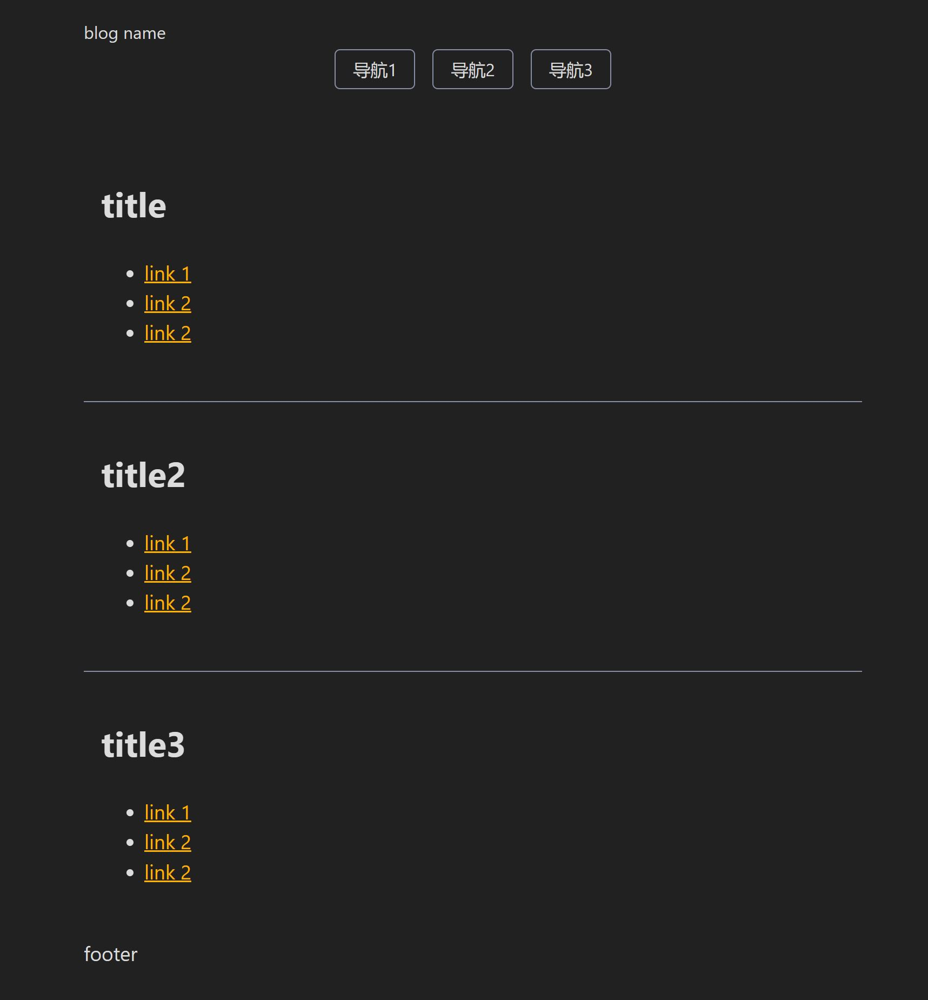

</img>

---
### 静态博客生成工具
#### 使用方式
- git clone && cd Xjournal
- zig build run
- ./zig-out/bin/xj.exe new content
- ./zig-out/bin/xj.exe build => output ./zig-out/bin/dist
- ./zig-out/bin/xj.exe serve -p 3000

---
### blog效果

